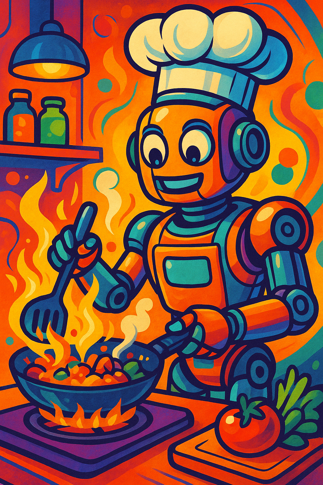
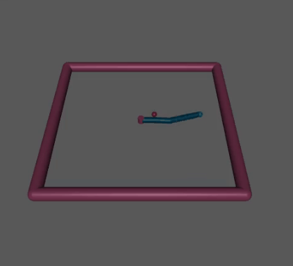
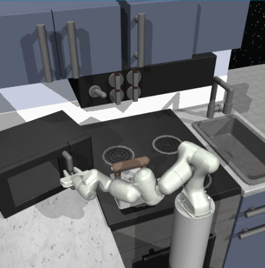
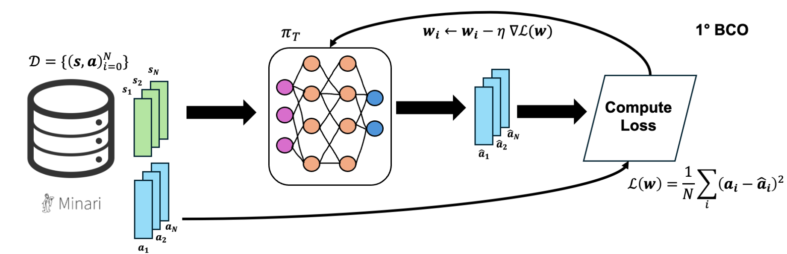
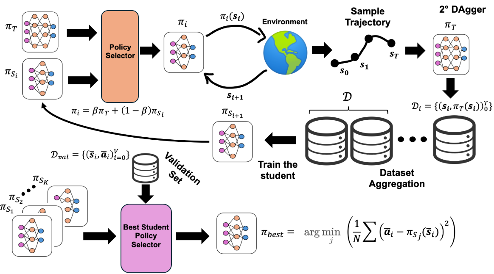
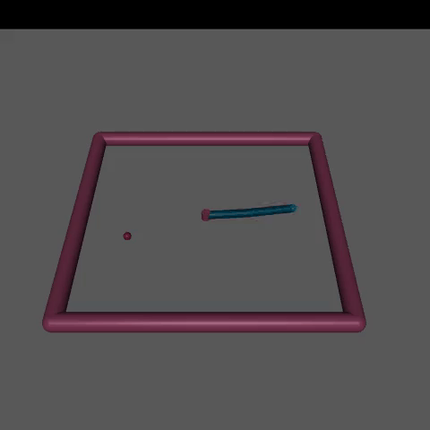
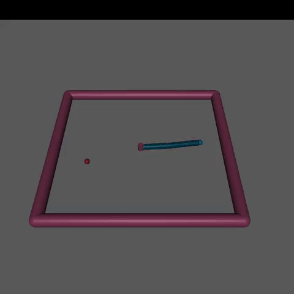
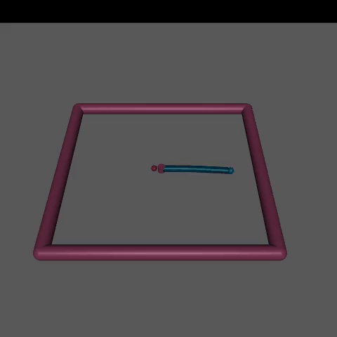

# 👨‍🍳 Imitation Learning in a kitchen environment 🤖



## 📖 Description
<p align="left">
  
  
</p>
In this project we have implemented Behavioral Cloning (BCO) and DAgger (Dataset Aggregation) in two reinforcement learning environments:

1. [Reacher](https://gymnasium.farama.org/environments/mujoco/reacher/) (Gymnasium)
   


3. [Franka Kitchen](https://robotics.farama.org/envs/franka_kitchen/franka_kitchen/) (Gymnasium-Robotics)
   


**BCO**
For BCO we have used an MLP deep network.



**DAgger**
To train the student we have used DAgger algorithm with a Shallow MLP network.




In particular we have used firstly the Reacher environment in order to test DAgger in a more "simple" env, while after that we have tested its performance in a more complicated one, Franka Kitchen. 

## 📚 Datasets
In order to use the BCO method, that is a supervised learning method, we have used [Minari](https://minari.farama.org/) datasets for both environments:

1. [Reacher Expert](https://minari.farama.org/datasets/mujoco/reacher/expert-v0/) and [Reacher Medium](https://minari.farama.org/datasets/mujoco/reacher/medium-v0/) datasets
2. [Franka Kitchen Complete](https://minari.farama.org/datasets/D4RL/kitchen/complete-v2/) (we have cutted the complete trajectories in order to do only the "microwave" task!)

---

## 🔧 Instructions

### 1. Clone the repository

```sh
git clone "https://github.com/cybernetic-m/DAgger4Robotics.git"
cd DAgger4Robotics
```
To run the following notebooks, you can upload the notebook directly on [Colab](https://colab.research.google.com/).

### 2. Run the "expert.ipynb" notebook (Behavioral Cloning Training)
In this notebook you can train with BCO both an expert for Reacher and Franka Kitchen.

### 3. Run the "reacher.ipynb" notebook (DAgger for Reacher)
In this notebook you can train with DAgger a student for Reacher env.

### 4. Run the "kitchen.ipynb" notebook (DAgger for Franka Kitchen)
In this notebook you can train with DAgger a student for Franka Kitchen env.


## 🗂 Folder Structure

```

```

---

## 📊 Reacher Performance
For Reacher we have tested three agent using the Expert dataset (the left), a filtered dataset (homemade) taking only mean reward over -0.1 (the center), and finally the Medium dataset (the right).

<p align="left">
  
  
   
</p>

This is a comparison between the Deep MLP Teacher (the left) and the Shallow MLP student (the right).

<p align="left">
  
  
</p>

---

## 📊 Franka Kitchen Performance

 

---

## 👤 Author

**Massimo Romano**  
GitHub: [@yourhandle](https://github.com/yourhandle)  
LinkedIn: [yourprofile](https://linkedin.com/in/yourprofile)
Website: [yourprofile](https://linkedin.com/in/yourprofile)

---

## 📄 License

This project is licensed under the MIT License.  
See the [LICENSE](./LICENSE) file for details.
