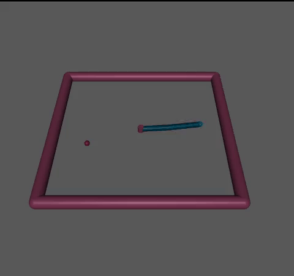
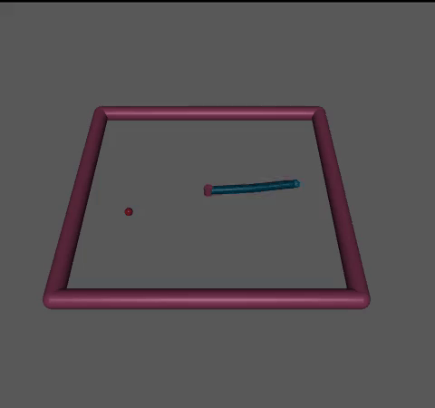
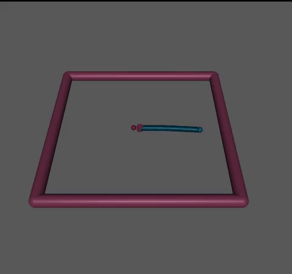
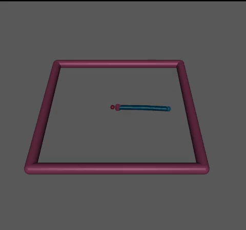
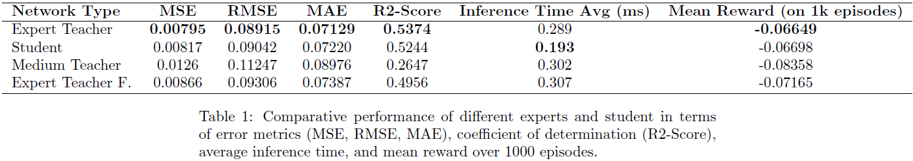
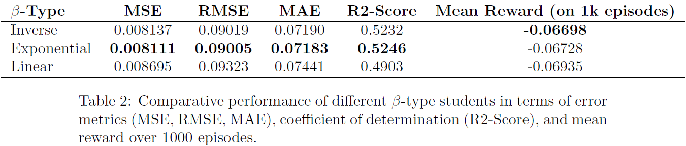
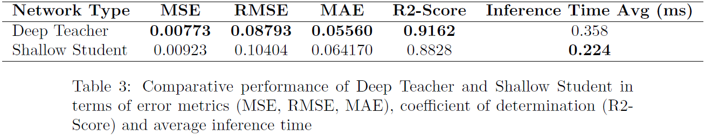
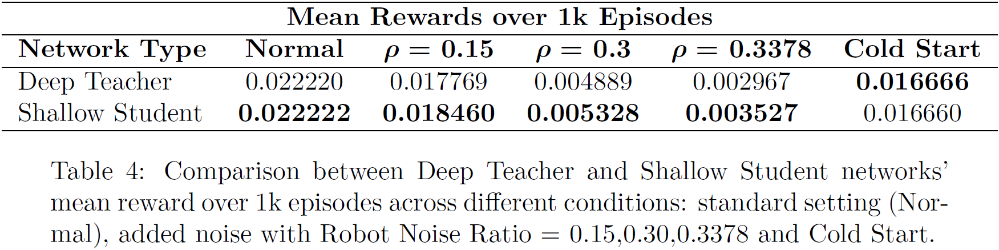

# 👨‍🍳 Imitation Learning in a kitchen environment 🤖

## 📖 Description

  
  

In this project we have implemented Behavioral Cloning (BCO) and DAgger (Dataset Aggregation) in two reinforcement learning environments:

1. [Reacher](https://gymnasium.farama.org/environments/mujoco/reacher/) (Gymnasium)
   

3. [Franka Kitchen](https://robotics.farama.org/envs/franka_kitchen/franka_kitchen/) (Gymnasium-Robotics)
   

**BCO**

For BCO we have used an MLP deep network.

**DAgger**

To train the student we have used DAgger algorithm with a Shallow MLP network (for Policy Distillation).

In particular we have used firstly the Reacher environment in order to test DAgger in a more "simple" env, while after that we have tested its performance in a more complicated one, Franka Kitchen. 

## 📽️ Presentation

⚠️**IMPORTANT**⚠️

We suggest you to read our presentation in order to understand the environments, action/observation spaces ... CLICK HERE  

## 📚 Datasets
In order to use the BCO method, that is a supervised learning method, we have used [Minari](https://minari.farama.org/) datasets for both environments:

1. [Reacher Expert](https://minari.farama.org/datasets/mujoco/reacher/expert-v0/) and [Reacher Medium](https://minari.farama.org/datasets/mujoco/reacher/medium-v0/) datasets
2. [Franka Kitchen Complete](https://minari.farama.org/datasets/D4RL/kitchen/complete-v2/) (we have cutted the complete trajectories in order to do only the "microwave" task!)

---

## 🔧 Colab Instructions

Follow these instructions if you want to run the notebooks on Colab:

### 2. Run the "expert.ipynb" notebook (Behavioral Cloning Training)  

In this notebook you can train with BCO both an expert for Reacher and Franka Kitchen.

### 3. Run the "reacher.ipynb" notebook (DAgger for Reacher)  

In this notebook you can train with DAgger a student for Reacher env.

### 4. Run the "kitchen.ipynb" notebook (DAgger for Franka Kitchen)  

In this notebook you can train with DAgger a student for Franka Kitchen env.

---

## 📊 Reacher Performance
For Reacher we have tested three agents using the Expert dataset (the left), a filtered dataset (homemade) taking only mean reward over -0.1 (the center), and finally the Medium dataset (the right).

  
  
   

This is a comparison between the Deep MLP Teacher (the left) and the Shallow MLP student (the right).

  
  

The following are the performance of the metrics and the mean reward on 1k episodes:

---

## 📊 Franka Kitchen Performance

For Franka Kitchen we have tested a Deep Teacher (BCO) using the Complete Minari dataset (the left), a Shallow Teacher (BCO) using also the Complete Minari dataset (center), and a Shallow Student (DAgger) (the right).

  
  
   

We have tested the Deep Teacher in presence of noise (setting the "robot_noise_ratio" variable of Franka Kitchen Environment). You can see the `robot_noise_ratio=0.29` (the left) and `robot_noise_ratio=0.30`.

  
  

We have tested also the Shallow Student obtained with DAgger training seeing that is more robust to the noise: in fact, you can see the `robot_noise_ratio=0.29` (the left) and `robot_noise_ratio=0.3378` (that it is able to recover the initial error).

  
  

Finally, we have tested a "Cold Start" situation, in which for the first 27 steps of the episode the joint/end_effector velocities are zeroed out. Both the Deep Teacher (the left) and the Shallow Student (the right) behave correctly to this situation.

  
  

The following are the tables with the metrics performance and the mean reward on 1k episodes:

---

## 👤 Author

**Massimo Romano**  

GitHub: [@cybernetic-m](https://github.com/cybernetic-m)  

LinkedIn: [Massimo Romano](https://www.linkedin.com/in/massimo-romano-01/)

Website: [Massimo Romano](https://sites.google.com/studenti.uniroma1.it/romano/home-page?authuser=0)

**Luca Del Signore**

GitHub: [@Puaison](https://github.com/Puaison)  

---

## 📄 License

This project is licensed under the MIT License.  
See the [LICENSE](./LICENSE) file for details.
